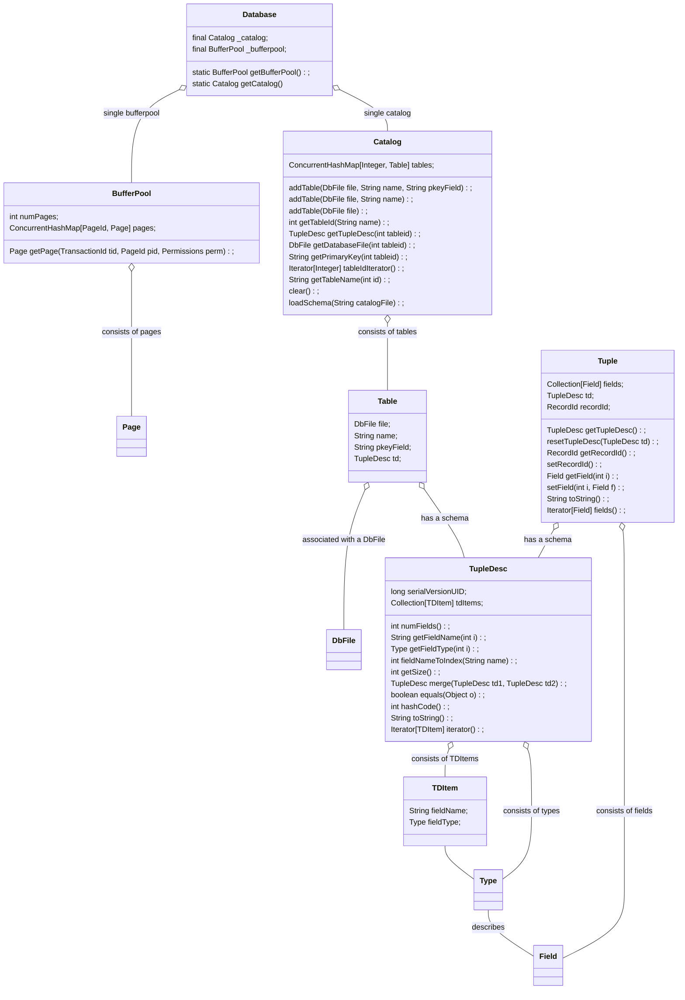

```mermaid
classDiagram
	class Database {
		final Catalog _catalog;
		final BufferPool _bufferpool;
		
		static BufferPool getBufferPool();
		static Catalog getCatalog()
	}
	
	class BufferPool {
		int numPages;
		ConcurrentHashMap[PageId, Page] pages;
		Page getPage(TransactionId tid, PageId pid, Permissions perm);
	}
	
	class Page
	
	class Catalog {
		ConcurrentHashMap[Integer, Table] tables;
		
		addTable(DbFile file, String name, String pkeyField);
		addTable(DbFile file, String name);
		addTable(DbFile file);
		
		int getTableId(String name);
		TupleDesc getTupleDesc(int tableid);
		DbFile getDatabaseFile(int tableid);
		String getPrimaryKey(int tableid);
		Iterator[Integer] tableIdIterator();
		String getTableName(int id);
		clear();
		
		loadSchema(String catalogFile);
	}
	
	class Table {
		DbFile file;
		String name;
		String pkeyField;
		TupleDesc td;
	}
	class Tuple {
		Collection[Field] fields;
		TupleDesc td;
		RecordId recordId;
		TupleDesc getTupleDesc();
		resetTupleDesc(TupleDesc td);
		RecordId getRecordId();
		setRecordId();
		Field getField(int i);
		setField(int i, Field f);
		String toString();
		Iterator[Field] fields();
	}
	class Field
	class TupleDesc {
		long serialVersionUID;
		Collection[TDItem] tdItems;
		int numFields();
		String getFieldName(int i);
		Type getFieldType(int i);
		int fieldNameToIndex(String name);
		int getSize();
		TupleDesc merge(TupleDesc td1, TupleDesc td2);
		boolean equals(Object o);
		int hashCode();
		String toString();
		Iterator[TDItem] iterator();
	}
	class TDItem {
		String fieldName;
		Type fieldType;
	}
	
	
	class Type
	
	Tuple o-- Field: consists of fields
	Tuple o-- TupleDesc: has a schema
	TupleDesc  o-- Type: consists of types
	TupleDesc o-- TDItem: consists of TDItems
	TDItem -- Type
	
	Type -- Field: describes
	
	Database o-- Catalog: single catalog
	Database o-- BufferPool: single bufferpool
	
	Catalog o-- Table: consists of tables
	Table o-- TupleDesc: has a schema
	Table o-- DbFile: associated with a DbFile
	
	BufferPool o-- Page: consists of pages
```